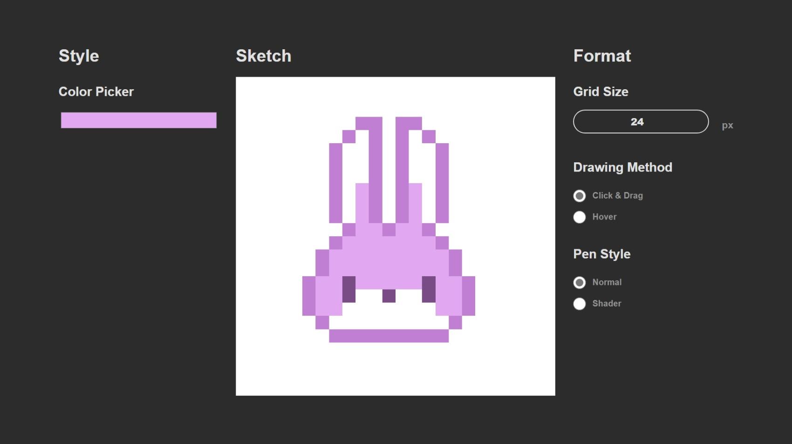
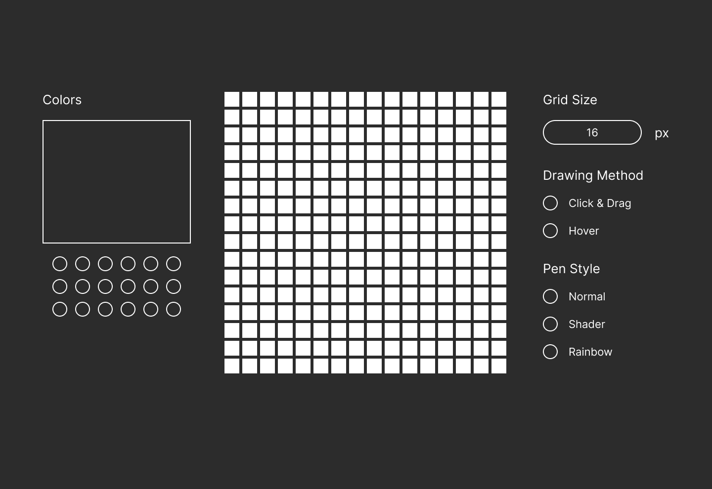

# The Odin Project - Etch a Sketch Solution 

This is a solution to the [Etch-a-Sketch challenge on The Odin Project](https://www.theodinproject.com/lessons/foundations-etch-a-sketch). The Odin Project is a free open-source coding curriculum that provides a comprehensive study path for aspiring developers. 

## Table of contents

- [Overview](#overview)
  - [Screenshot](#screenshot)
  - [Links](#links)
- [My process](#my-process)
  - [Built with](#built-with)
  - [What I learned](#what-i-learned)
  - [Continued development](#continued-development)
  - [Useful resources](#useful-resources)
- [Author](#author)
- [Acknowledgments](#acknowledgments)

## Overview

### Screenshots

#### Final Screenshot

<!-- #### Wireframe Prototype
 -->

### Links

- Solution URL: [https://github.com/colleennicole223/odin-etch-a-sketch](https://github.com/colleennicole223/odin-etch-a-sketch)
- Live Site URL: [https://colleennicole223.github.io/odin-etch-a-sketch/](https://colleennicole223.github.io/odin-etch-a-sketch/)

## My process

### Built with

- Figma (wireframe)
- HTML
- CSS
  - Flex Containers 
  - Custom Properties 
- JavaScript 
  - DOM Manipulation
    - Element creation to add all of the squares in the grid based on a user defined size 
    - Element removal to remove squares and replace them when grid size is updated
    - Event Listeners to update pen color and grid size when input is changed

### What I learned

- Using '!+tab' will autofill the HTML boilerplate 🤯
- Can put a min and max range on an input element and that there are a lot of different input types 
- Explored different types of event listeners (mouseover, mouseup/down) 🖱️
- DOM element creation can be removed and replaced 

### Continued development

Once I learn more about grids, I plan to come back and restructure this project. This will make it less demanding to create a higher resolution canvas. 

## Author

- Personal Website - [Colleen Nicole](https://www.colleennicole.com)
- Project Website - [The Odin Project](https://www.theodinproject.com)

